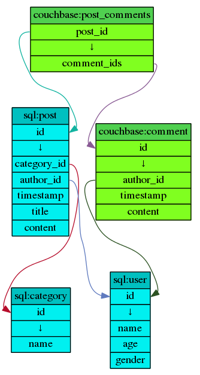

datagraph
=========

Datagraph is a minimalist data description language specifically designed for visualizing objects, their fields and their relations in a system.

The datagraph language gets transcompiled to the dot language of Graphviz.  Graphviz is then able to generate a wide range of output formats such as PNG, PDF or PostScript.

Rather than formally specifying the language let's take a look at:

example.datagraph:

    namespace sql #00c0c0 #00f0f0
    namespace couchbase #50d050 #80ff20

    object sql:post [id] -> [category_id, author_id, timestamp, title, content]
    object couchbase:comment [id] -> [author_id, timestamp, content]
    object sql:user [id] -> [name, age, gender]
    object sql:category [id] -> [name]

    object couchbase:post_comments [post_id] -> [comment_ids]
    relationship .post_id -> sql:post.id
    relationship .comment_ids -> couchbase:comment.id

    relationship sql:post.author_id -> sql:user.id
    relationship sql:post.category_id -> sql:category.id
    relationship couchbase:comment.author_id -> sql:user.id

After creating the above files let's fire up the console:

    datagraph example.datagraph > example.gv
    dot example.gv -Tpng > example.png

example.png:

